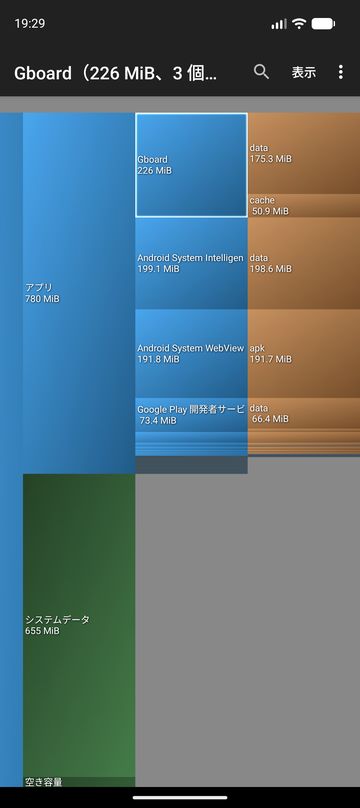

DiskUsage
=========

[日本語](README.md) | English

DiskUsage provides a way to find files and directories on storage which consume a lot of space.

It displays a diagram on which directories are displayed proportional to their size, also a few levels of subdirectories are displayed.
Users are allowed to zoom in to look at specific directory content.
Purpose of the program is to provide a way to find and clean up space hogs on storage. It is not a general purpose file manager.



## About this fork

This is an update for recent Android versions of
[the fork maintained by WhiredPlanck](https://github.com/WhiredPlanck/diskusage)
of [DiskUsage by Ivan Volosyuk](https://github.com/IvanVolosyuk/diskusage). Main changes:

- Supports Android 17 (API 37), including devices with 16 KB memory pages.
- The fast native scanner is fixed and used again.
- Japanese translation, and all the existing translations are completed.
- The whole app is rewritten in Kotlin and draws with hardware accelerated Canvas.

See the [releases](https://github.com/taketake5656/diskusage/releases) for details.

## Installation

Download the latest APK from the [releases](https://github.com/taketake5656/diskusage/releases) and install it.

- Requires Android 6.0 (API 23) or later.
- It's signed with a different key than other builds of DiskUsage, so uninstall them first.

## Permissions

| Permission | Used for |
| --- | --- |
| All files access | Finding the size of files and directories on the storage, and deleting them |
| Usage access | Displaying the data and cache size of apps (optional) |

The app asks for the missing permissions one by one when showing a storage.
On rooted devices, all the mount points can be displayed as well.

## Usage

- Select a storage to scan it and see its usage diagram.
- Tap a directory to zoom in, tap it again to zoom out. Pinch to zoom as well.
- The menu opens the selected file or directory in another app, or deletes it.
- The magnifier icon searches files and directories by name.
- The app language can be changed in the system settings (Settings > Apps > DiskUsage > Language).

## Building

Requirements:

- JDK 21 and JDK 17 (Gradle downloads them if they aren't found)
- Android SDK Platform 37, NDK 29.0.14206865, CMake 4.1.2

```sh
./gradlew assembleDebug        # debug APK
./gradlew testDebugUnitTest    # unit tests
```

To sign release builds, set the following Gradle properties, e.g. in `~/.gradle/gradle.properties`.
Release builds are unsigned without them.

```properties
diskusageKeystoreFile=/path/to/release.jks
diskusageKeystorePassword=...
diskusageKeyAlias=...
diskusageKeyPassword=...
```

GitHub Actions builds, tests and lints every push, and creates a release with the signed APK for pushed `v*` tags.

## License

[GNU General Public License v2.0](COPYING.txt) or later
